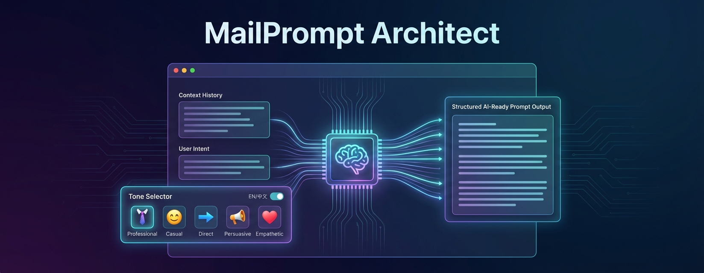
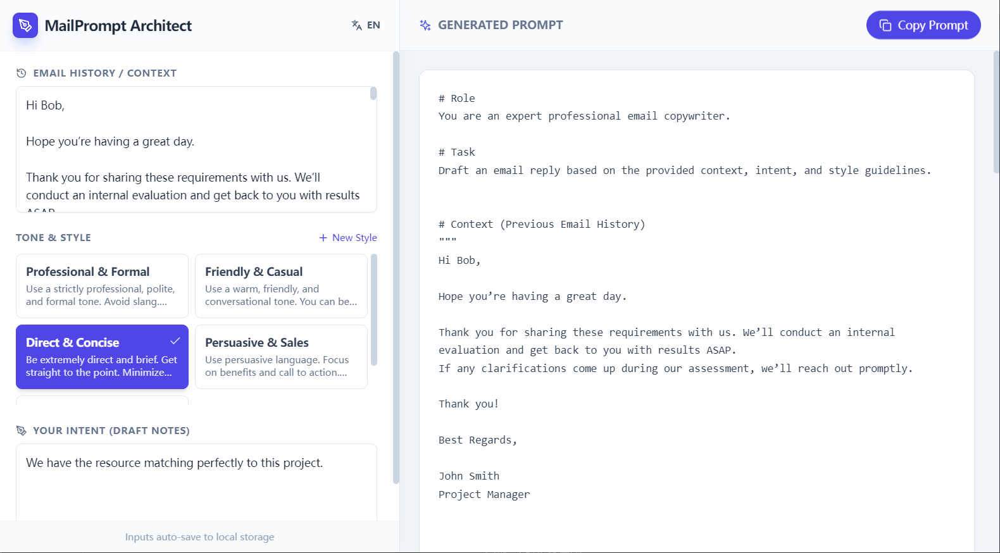

# MailPrompt Architect
  


A desktop-class application to generate structured LLM prompts for professional email writing.

This tool helps you craft effective prompts for large language models to generate professional emails with the perfect tone and style for any situation.


## Features

- **Multiple Email Styles**: Choose from 5 preset tones including Professional & Formal, Friendly & Casual, Direct & Concise, Persuasive & Sales, and Apathetic & Empathetic
- **Bilingual Support**: Switch between English and Chinese interfaces
- **Custom Styles**: Create your own custom email styles for specific use cases
- **Context Awareness**: Paste email threads to provide context for your response
- **Intent Capture**: Clearly define your intent before generating the prompt
- **Auto-save**: All inputs are automatically saved to local storage
- **Easy Copy**: One-click copy of generated prompts to clipboard
- **Token Estimation**: Estimate token count of generated prompts before copying
- **Cross-platform**: Works on Windows, macOS, and Linux as a desktop application

## Run Locally

**Prerequisites:** Node.js (version 16 or higher recommended)

1. Clone the repository:
   ```bash
   git clone git@github.com:zgldh/mailprompt-architect.git
   ```

2. Navigate to the project directory:
   ```bash
   cd mailprompt-architect
   ```

3. Install dependencies:
   ```bash
   npm install
   ```

4. Run the app in development mode:
   ```bash
   npm run dev
   ```

## Build Desktop Application

To build the application for your platform:

```bash
npm run dist
```

The built application will be available in the `release/` directory.

## How to Use

1. Select your preferred language (English/Chinese) from the toggle in the header
2. Provide context by pasting the email thread or conversation history in the "Email History / Context" section
3. Describe your intent in the "Your Intent" section - be as specific as possible
4. Choose an appropriate tone/style from the presets or create a custom one
5. The AI-generated prompt will appear in the right panel
6. Copy the prompt and use it with your favorite AI assistant


  


## Technical Details

- Built with React and TypeScript
- Uses Vite for fast development and building
- Electron-based desktop application
- Responsive design that works on various screen sizes
- Local storage for saving preferences and input history
- No data leaves your computer - all processing happens locally except for AI API calls

## Acknowledgements

This project was inspired by [https://github.com/glebkudr/shotgun_code](https://github.com/glebkudr/shotgun_code).

## Contributing

Contributions are welcome! Feel free to submit issues or pull requests.

## License

This project is licensed under the MIT License - see the [LICENSE](LICENSE) file for details.